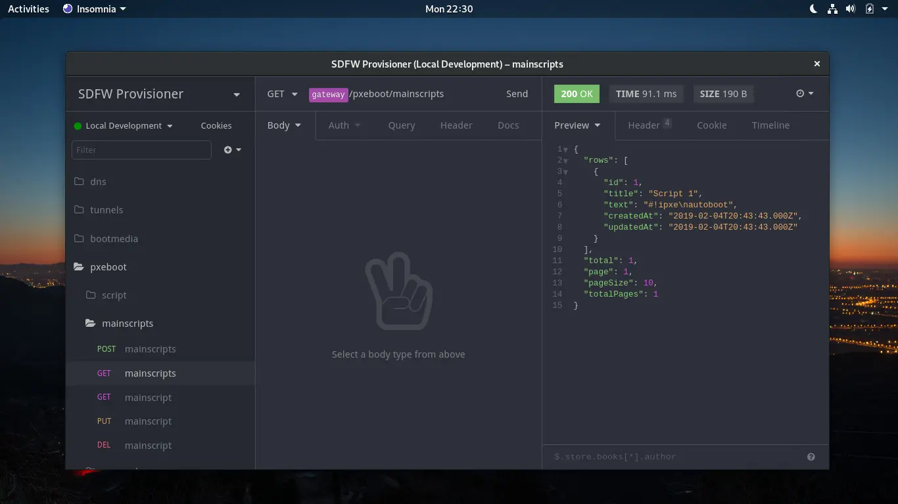

# Felicitas Pojtinger's Provisioner



Hosts as a service.

## Features

- [DNS](./src/services/dns/dns.js) (with DNSMasq, configured using a `/etc/hosts`-like syntax)
- [Tunneling](./src/services/gateway/gateway.js) (expose globally without port forwarding or VPN)
- [Boot media](./src/services/provisioner/bootmedia.js) (generate ISOs for iPXE so that you can boot globally)
  - [GRUB compiler](./src/services/provisioner/grub.js)
  - [SYSLINUX compiler](./src/services/provisioner/syslinux.js)
  - [iPXE compiler](./src/services/provisioner/ipxe.js)
  - [ISO generator](./src/services/provisioner/iso.js)
- [PXE boot](./src/services/pxeboot/pxeboot.js)
  - [TFTP server and DHCP boot](./src/services/pxeboot/pxeboot.js) (with DNSMasq)
  - [Embedded script](./src/services/pxeboot/pxeboot.js)
  - [Main scripts](./src/services/provisioner/mainscripts.js)
  - [Preseed scripts](./src/services/provisioner/preseeds.js)
  - [Postseed script](./src/services/provisioner/postseeds.js)

All the following features have been implemented as independent and horizontally scalable microservices. They are exposed using a REST API gateway.

## Usage

```bash
# Start development version in Docker
npm run dev
```

Now, you can either use the REST api directly on [localhost:3000/api](http://localhost:3000/api) or import the [Insomnia Export](./assets/SDFW-Provisioner_2019-02-04.json) into [Insomnia](https://insomnia.rest/).

## Debugging

- If you're trying to start the DNS or PXE boot services, but you get an error like `dnsmasq: failed to bind DHCP server socket: Address already in use`, that means that your host is likely running `dnsmasq` itself. Try and run `pkill -9 dnsmasq` as `root` on the host to kill the process.
- If you send a script using URL parameters instead of a JSON body, don't escape `${...}` as `\${...}` manually or you will end up with very cryptic error messages and/or an instant reboot if you try to chain iPXE/the script with iPXE/GRUB/SYSLINUX!

## Docs

See [Platform README](../../README.md).
